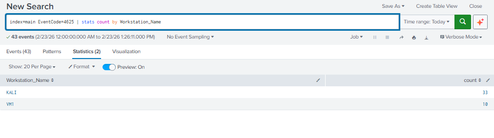
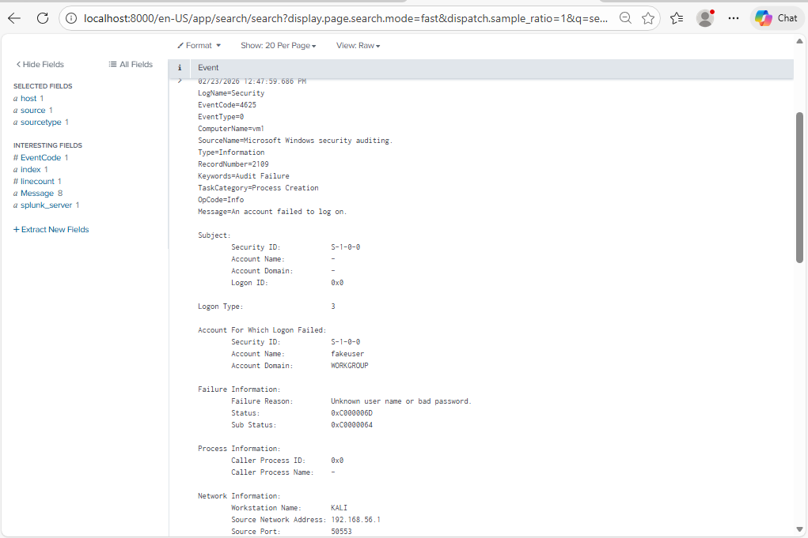
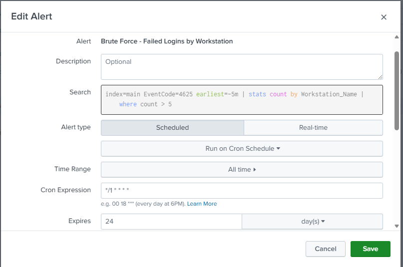
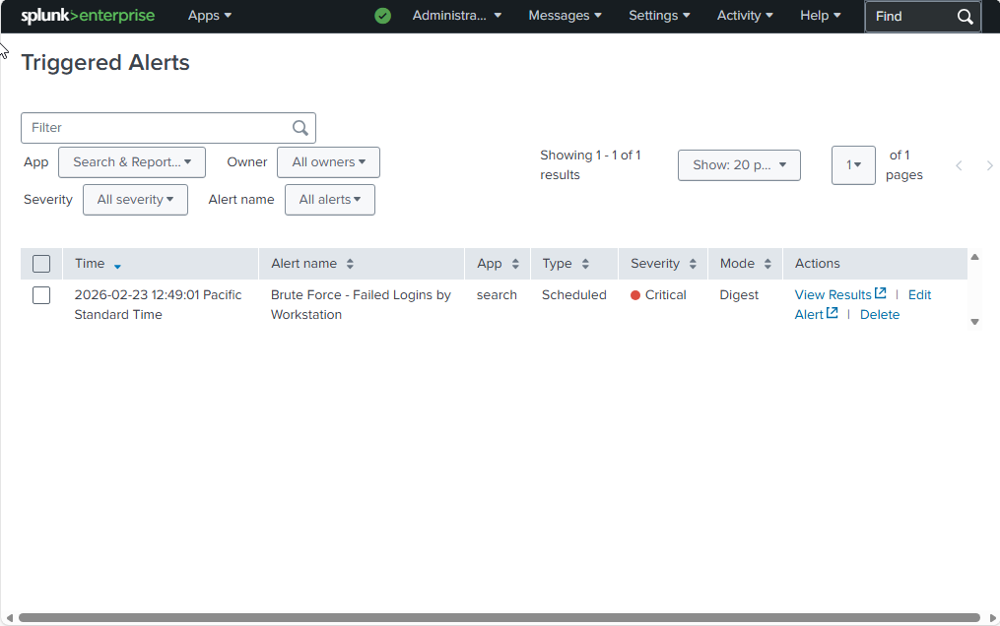
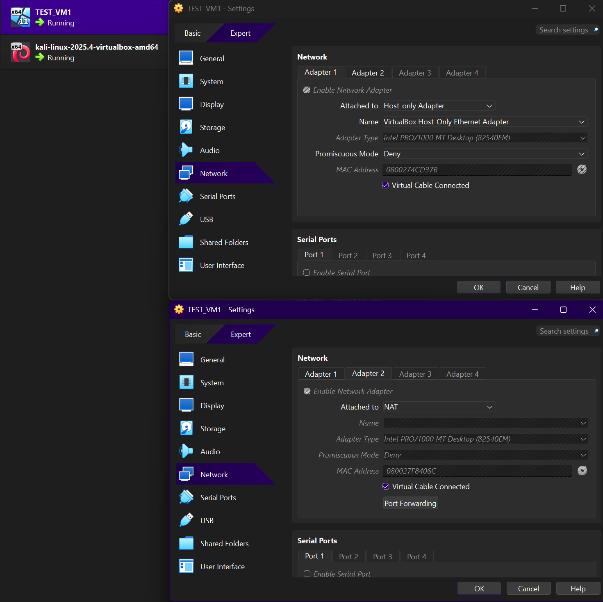

# SOC Home Lab – Brute Force Detection Using Splunk

## Overview
This project demonstrates detection of Windows brute-force authentication attempts using Splunk in a controlled home lab environment.

## Lab Environment
- Windows 11 VM (Victim + Splunk)
- Kali Linux VM (Attacker)
- VirtualBox dual network configuration:
  - NAT adapter (Internet access)
  - Host-Only adapter (Isolated attack network)

## Attack Simulation
Generated multiple failed SMB authentication attempts from Kali Linux using:

```bash
smbclient -L //192.168.56.101 -U fakeuser
```

This produced Windows Security Event ID **4625** logs.

## Detection Query (SPL)

```spl
index=main EventCode=4625 earliest=-5m
| stats count by Workstation_Name
| where count > 5
```

This query identifies repeated failed authentication attempts from a single workstation within a 5-minute window.

## Alert Configuration
- Scheduled every 5 minutes
- Cron expression: `*/5 * * * *`
- Trigger condition: Number of results > 0
- Throttle: 10 minutes
- Action: Add to Triggered Alerts

## Validation
Performed 8 consecutive failed authentication attempts from Kali.
The alert successfully triggered, confirming detection logic functionality.

## Skills Demonstrated
- Windows Security Event log analysis
- Splunk SPL query development
- Threshold-based detection engineering
- Alert scheduling and throttling
- Virtual network segmentation
- Attack simulation and validation

## Screenshots

### Detection Query


### Event ID 4625


### Alert Configuration


### Triggered Alert


### Lab Architecture

